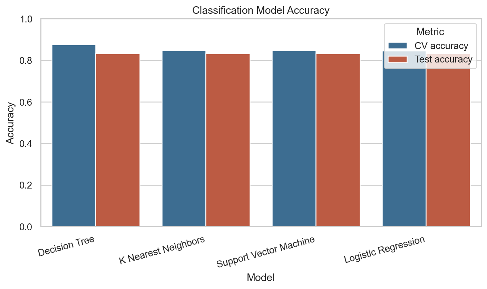
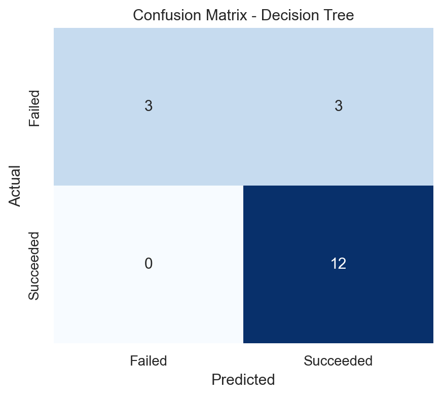

# SpaceX Launch Outcome Prediction

> **This is coursework.** It is the capstone for the
> [IBM Data Science Professional Certificate](https://coursera.org/verify/professional-cert/8AN7IW7CHZQP),
> completed May 2026. The problem, the dataset and the lab structure are set by
> the course — this is not original research. It is here as a worked example of
> the Python, SQL and modelling workflow end to end.

Predicting whether a SpaceX Falcon 9 first stage will land successfully. Landing
recovery is most of the cost difference between a $62m launch and a competitor's
$165m, so predicting it is effectively predicting launch cost.

## Pipeline

| # | Notebook | What happens |
|---|---|---|
| 01 | [Data collection](notebooks/01-data-collection-api.ipynb) | Pull launch records from the SpaceX REST API, flatten nested JSON into a flat frame |
| 02 | [Web scraping](notebooks/02-web-scraping.ipynb) | Scrape the Falcon 9 launch table off Wikipedia with BeautifulSoup as a second source |
| 03 | [Data wrangling](notebooks/03-data-wrangling.ipynb) | Handle missing values, derive the binary landing-outcome label from free-text outcomes |
| 04 | [EDA — visualisation](notebooks/04-eda-visualisation.ipynb) | Relationships between payload, orbit, launch site, flight number and success |
| 05 | [EDA — SQL](notebooks/05-eda-sql.ipynb) | The same questions asked in SQL against SQLite |
| 06 | [Geospatial](notebooks/06-launch-site-geospatial.ipynb) | Folium maps — launch site locations, outcomes, proximity to coast, rail and roads |
| 07 | [Modelling](notebooks/07-ml-prediction.ipynb) | Four classifiers, grid-searched and compared |

## What the data showed

- Success rate climbs steadily from 2013 onward — the programme learned over time.
- Orbit matters a great deal. Some orbits (ES-L1, GEO, HEO, SSO) show 100% success
  in this dataset; GTO sits far lower. Several of those are small-sample, so the
  rates are not as solid as they look.
- Heavier payloads land successfully more often at some sites than others — the
  effect is confounded with orbit and era rather than being causal.
- KSC LC-39A has the strongest success record of the launch sites.

## Modelling result

Logistic Regression, SVM, Decision Tree and KNN were tuned with `GridSearchCV`
and evaluated on a held-out set.



**All four land on the same 83.3% test accuracy.** The Decision Tree scored
highest in cross-validation (~87.5%) but did not carry that advantage to the
test set.

The honest reading is that this comparison does not separate the models. The test
set is 18 rows — one prediction is worth 5.6 percentage points, so the identical
scores say more about the size of the split than about the classifiers. The
confusion matrix shows where the error actually sits: the models rarely miss a
successful landing, and most of the error is failed landings predicted as
successes.



With ~90 usable rows, the sensible next step would be repeated stratified
cross-validation rather than a single split.

## Contents

```
notebooks/   the seven labs, in order
report/      final report (PDF) and the figures behind it
```

## Reproducing the notebooks

```bash
python -m venv .venv
python -m pip install -r requirements.txt
jupyter lab
```

Run the notebooks in numeric order. The first two call public SpaceX and Wikipedia endpoints, so a fresh execution can differ from the committed course-era results if those external sources change. The committed outputs preserve the analysed snapshot.

CI performs a deterministic integrity check: all seven files must satisfy the notebook v4 core schema (while permitting harmless exporter-added fields) and may not contain committed Python error outputs. It deliberately does not re-run network-dependent coursework on every commit.

## Stack

Python · pandas · NumPy · scikit-learn · Matplotlib · Seaborn · Folium ·
BeautifulSoup · SQLite · Jupyter
